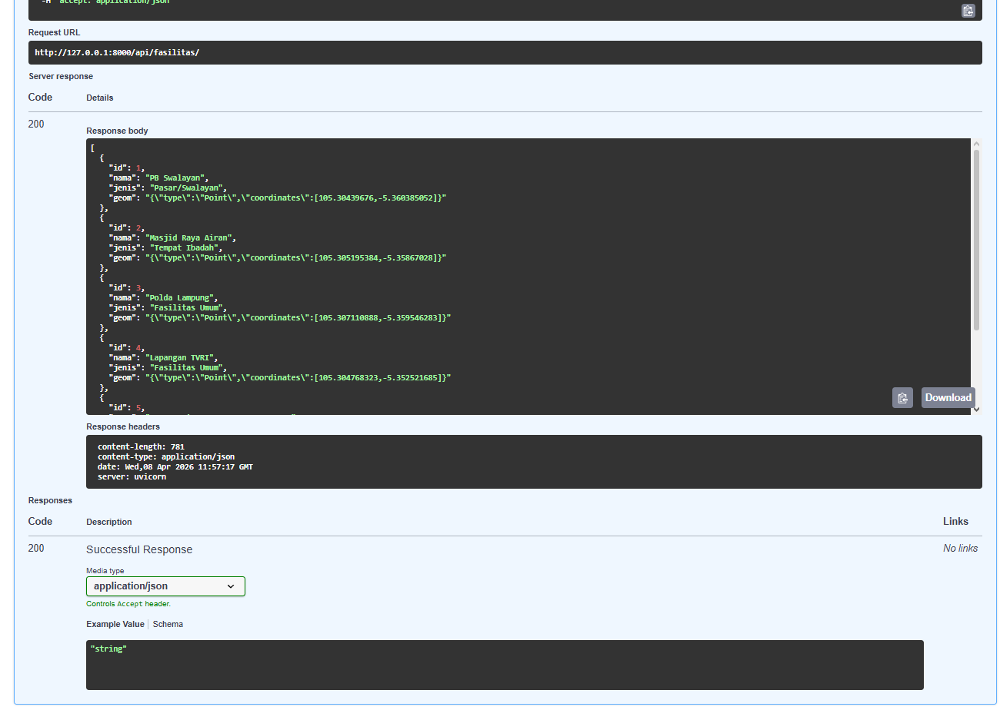
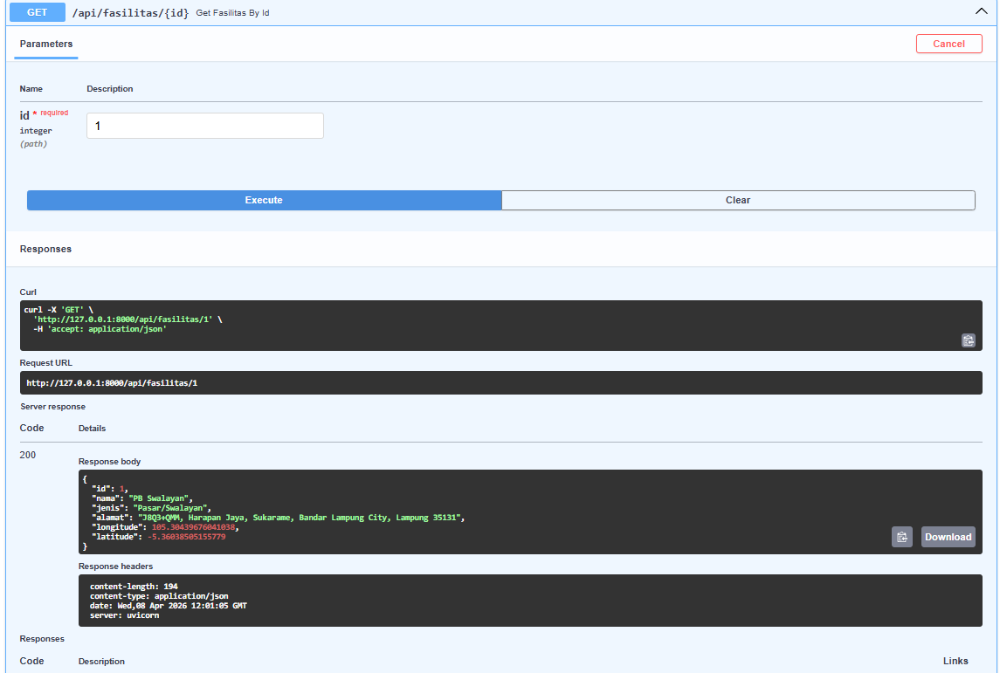
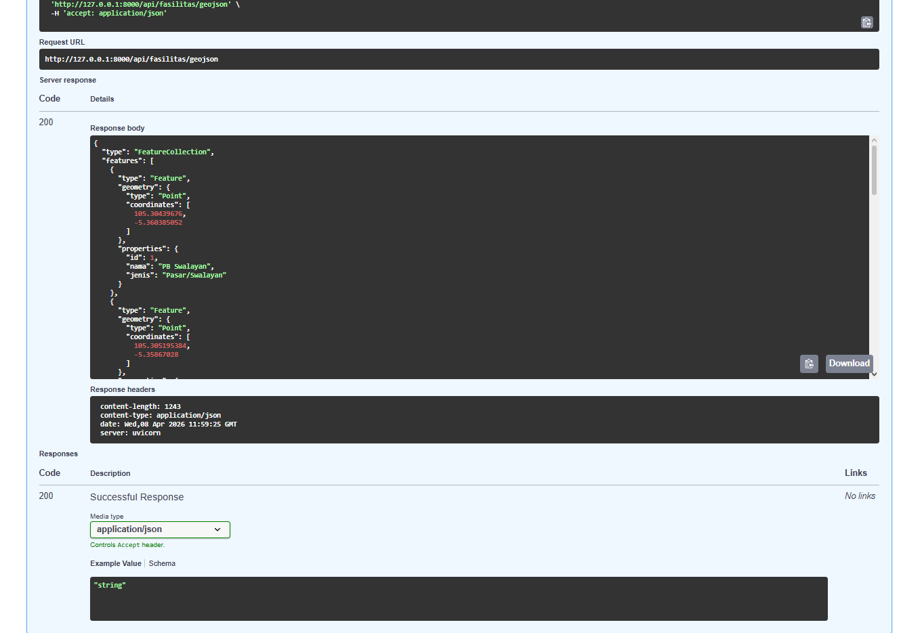
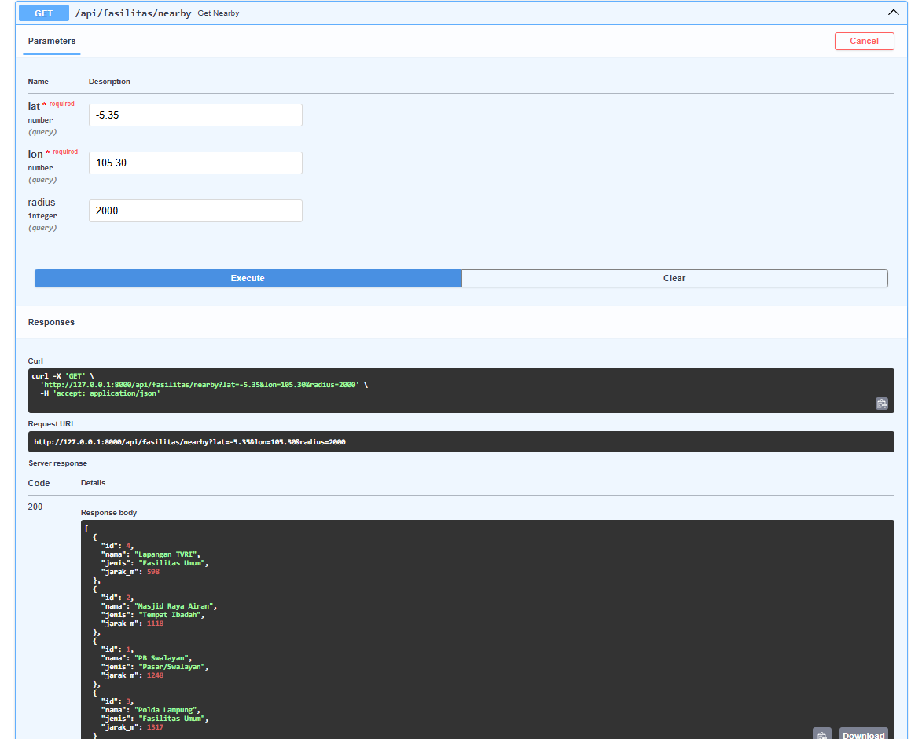
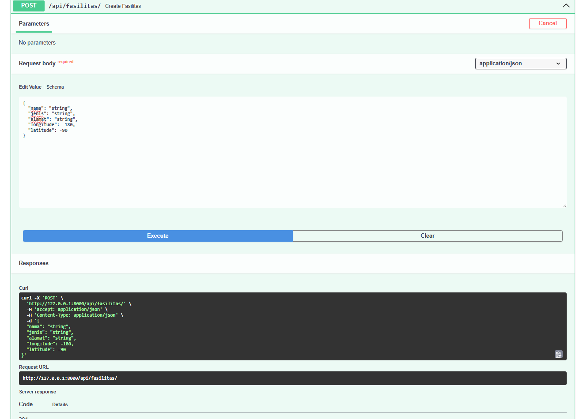

**Nama:** Adi Septriansyah  
**NIM:** 123140021  
**Program Studi:** Teknik Informatika  

---

## 1. Tujuan Praktikum
Berdasarkan modul pertemuan 7, praktikum ini bertujuan agar mahasiswa mampu:
a. Memahami konsep REST API dan arsitektur backend.
b. Membuat project FastAPI dengan koneksi yang efisien ke PostGIS menggunakan `asyncpg`.
c. Menerapkan Pydantic untuk validasi input data.
d. Mengimplementasikan minimal 5 endpoint (GET All, GET by ID, GET GeoJSON, POST, dan GET Nearby) untuk melakukan operasi CRUD dan query spasial.

## 2. Persiapan dan Koneksi Database
Langkah pertama adalah melakukan instalasi *dependencies* yang dibutuhkan, yaitu `fastapi`, `uvicorn`, `asyncpg`, dan `python-dotenv`.

Setelah lingkungan siap, dibuat file `database.py` untuk mengonfigurasi Connection Pool ke PostgreSQL/PostGIS. Connection pool digunakan agar backend tidak perlu membuat koneksi baru setiap kali ada request, sehingga jauh lebih cepat dan efisien dalam menangani query spasial.

**File `database.py`:**
```python
import asyncpg
from dotenv import load_dotenv
import os

load_dotenv()
DATABASE_URL = os.getenv("DATABASE_URL")

pool = None

async def get_pool():
    global pool
    if pool is None:
        pool = await asyncpg.create_pool(DATABASE_URL, min_size=5, max_size=20)
    return pool

async def close_pool():
    global pool
    if pool:
        await pool.close()
        pool = None
```

### Pemodelan Data (Pydantic Validation)
Untuk memastikan data spasial yang di-input oleh pengguna (client) ke server sudah valid dan aman, digunakan Pydantic. Pydantic memvalidasi tipe data secara otomatis, misalnya memastikan bahwa parameter longitude dan latitude memiliki rentang nilai yang logis secara geografis.

**File `models.py`:**
```python
from pydantic import BaseModel, Field
from typing import Optional

class FasilitasCreate(BaseModel):
    nama: str = Field(..., min_length=3)
    jenis: str
    alamat: Optional[str] = None
    longitude: float = Field(..., ge=-180, le=180)
    latitude: float = Field(..., ge=-90, le=90)
```

### Implementasi Endpoint REST API
Sesuai instruksi tugas, dibangun 5 endpoint utama pada file `routers/fasilitas.py` yang akan dihubungkan ke aplikasi utama (`main.py`).

**File `routers/fasilitas.py`:**
```python
from fastapi import APIRouter, HTTPException
from database import get_pool
from models import FasilitasCreate
import json

router = APIRouter(prefix="/api/fasilitas", tags=["Fasilitas"])

# 1. GET All
@router.get("/")
async def get_all_fasilitas():
    pool = await get_pool()
    async with pool.acquire() as conn:
        rows = await conn.fetch("SELECT id, nama, jenis, ST_AsGeoJSON(geom) as geom FROM fasilitas LIMIT 100")
        return [dict(row) for row in rows]

# 2. GET GeoJSON (Wajib Format FeatureCollection)
@router.get("/geojson")
async def get_fasilitas_geojson():
    pool = await get_pool()
    async with pool.acquire() as conn:
        rows = await conn.fetch("SELECT id, nama, jenis, ST_AsGeoJSON(geom) as geom FROM fasilitas")
        features = [{
            "type": "Feature",
            "geometry": json.loads(row["geom"]),
            "properties": {"id": row["id"], "nama": row["nama"], "jenis": row["jenis"]}
        } for row in rows]
        return {"type": "FeatureCollection", "features": features}

# 3. GET Nearby (Query Spasial Radius)
@router.get("/nearby")
async def get_nearby(lat: float, lon: float, radius: int = 1000):
    pool = await get_pool()
    async with pool.acquire() as conn:
        rows = await conn.fetch("""
            SELECT id, nama, jenis, ROUND(ST_Distance(geom::geography, ST_Point($1, $2)::geography)::numeric) as jarak_m
            FROM fasilitas WHERE ST_DWithin(geom::geography, ST_Point($1, $2)::geography, $3) ORDER BY jarak_m
        """, lon, lat, radius)
        return [dict(row) for row in rows]

# 4. GET by ID
@router.get("/{id}")
async def get_fasilitas_by_id(id: int):
    pool = await get_pool()
    async with pool.acquire() as conn:
        row = await conn.fetchrow("SELECT id, nama, jenis, alamat, ST_X(geom) as longitude, ST_Y(geom) as latitude FROM fasilitas WHERE id = $1", id)
        if not row:
            raise HTTPException(status_code=404, detail="Fasilitas tidak ditemukan")
        return dict(row)

# 5. POST (Input Data Spasial)
@router.post("/", status_code=201)
async def create_fasilitas(data: FasilitasCreate):
    pool = await get_pool()
    async with pool.acquire() as conn:
        row = await conn.fetchrow("""
            INSERT INTO fasilitas (nama, jenis, alamat, geom)
            VALUES ($1, $2, $3, ST_SetSRID(ST_Point($4, $5), 4326))
            RETURNING id, nama, jenis, alamat, ST_X(geom) as longitude, ST_Y(geom) as latitude
        """, data.nama, data.jenis, data.alamat, data.longitude, data.latitude)
        return dict(row)
```

**File `main.py`:**
```python
from fastapi import FastAPI
from contextlib import asynccontextmanager
from database import get_pool, close_pool
from routers import fasilitas

@asynccontextmanager
async def lifespan(app: FastAPI):
    await get_pool()
    yield
    await close_pool()

app = FastAPI(title="WebGIS API", lifespan=lifespan)
app.include_router(fasilitas.router)
```

## 3. Pengujian API (Swagger UI)
Pengujian kelima endpoint dilakukan menggunakan fitur dokumentasi interaktif bawaan FastAPI (Swagger UI) yang diakses melalui `http://127.0.0.1:8000/docs`. Seluruh endpoint mengembalikan status 200 OK dan 201 Created, yang menandakan API berfungsi dengan sempurna.

**a. Pengujian Endpoint GET All (`/api/fasilitas`)** Mendapatkan list data fasilitas.  


**b. Pengujian Endpoint GET by ID (`/api/fasilitas/{id}`)** Mencari detail fasilitas spesifik berdasarkan ID.  


**c. Pengujian Endpoint GET GeoJSON (`/api/fasilitas/geojson`)** Mendapatkan seluruh titik dalam format standar `FeatureCollection`.  


**d. Pengujian Endpoint GET Nearby (`/api/fasilitas/nearby`)** Mencari fasilitas di sekitar titik koordinat tertentu berdasarkan radius meter.  


**e. Pengujian Endpoint POST (`/api/fasilitas`)** Berhasil menambahkan data titik fasilitas spasial baru ke dalam basis data.  


## 4. Kesimpulan
Berdasarkan praktikum ini, dapat disimpulkan bahwa FastAPI merupakan framework backend yang sangat handal untuk pengembangan aplikasi WebGIS. Dikombinasikan dengan pustaka asinkron `asyncpg`, server dapat menangani query keruangan ke PostGIS dengan sangat cepat tanpa memblokir alur proses (*non-blocking*). Selain itu, fitur otomatisasi konversi ke format pemetaan standar seperti GeoJSON dan skema validasi Pydantic menjadikan arsitektur API ini aman, rapi, dan sangat siap untuk diintegrasikan secara langsung dengan *frontend map* (seperti React + Leaflet) pada tahap pengembangan WebGIS selanjutnya.
